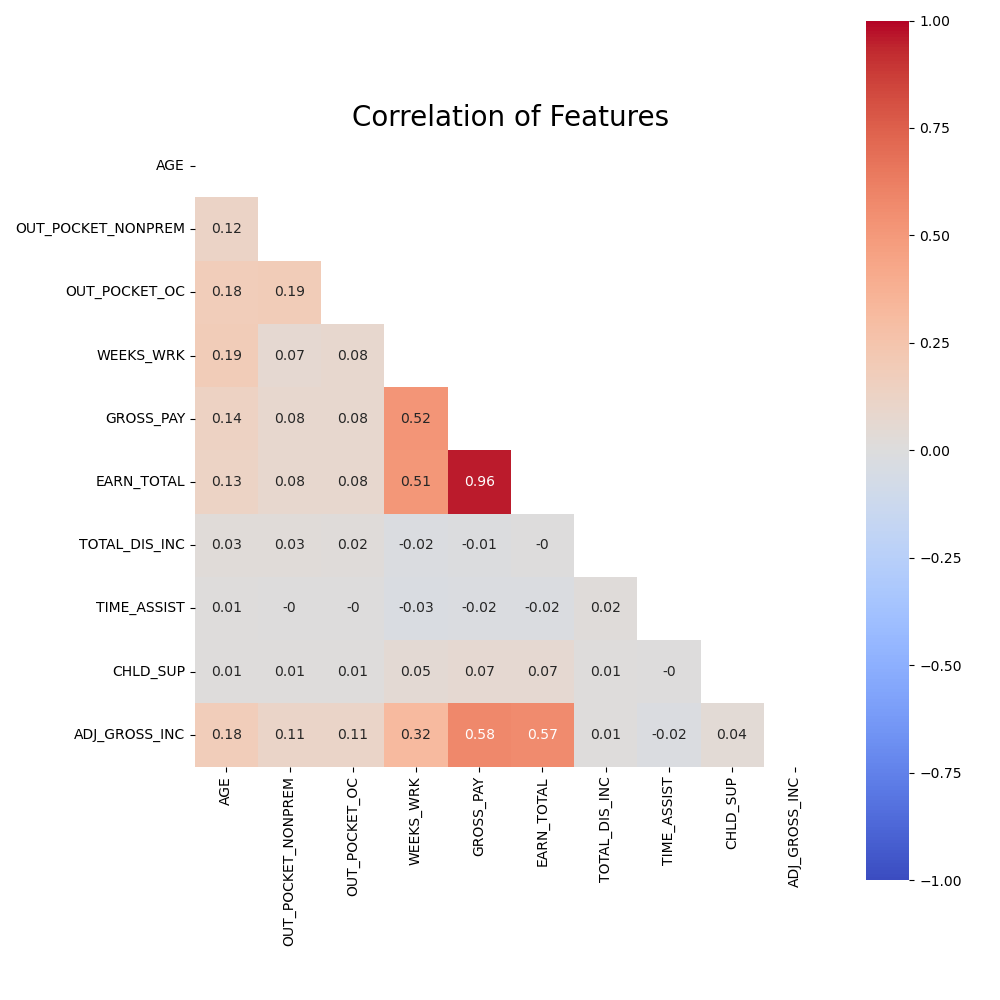
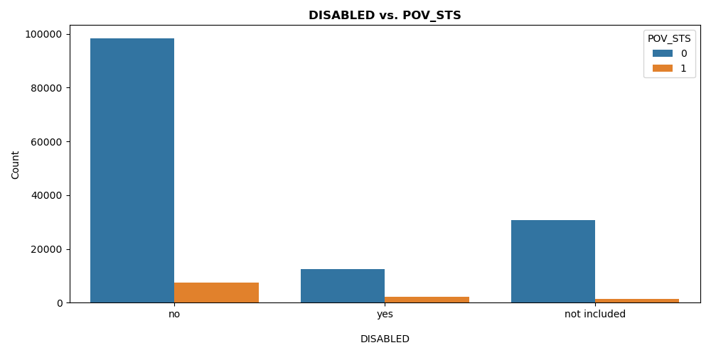
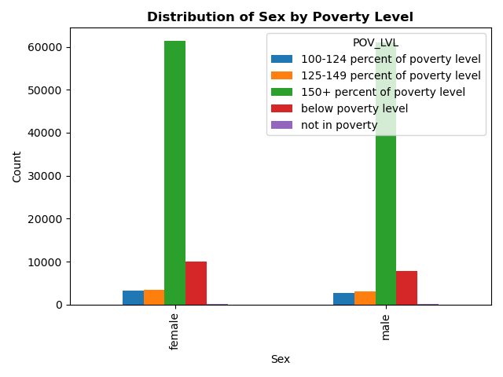
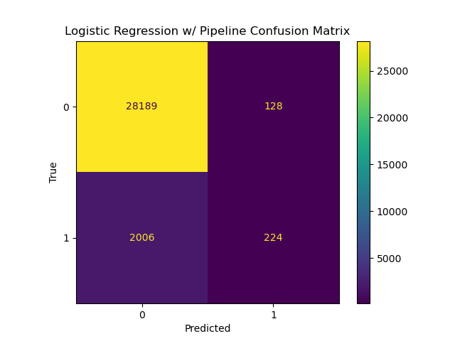
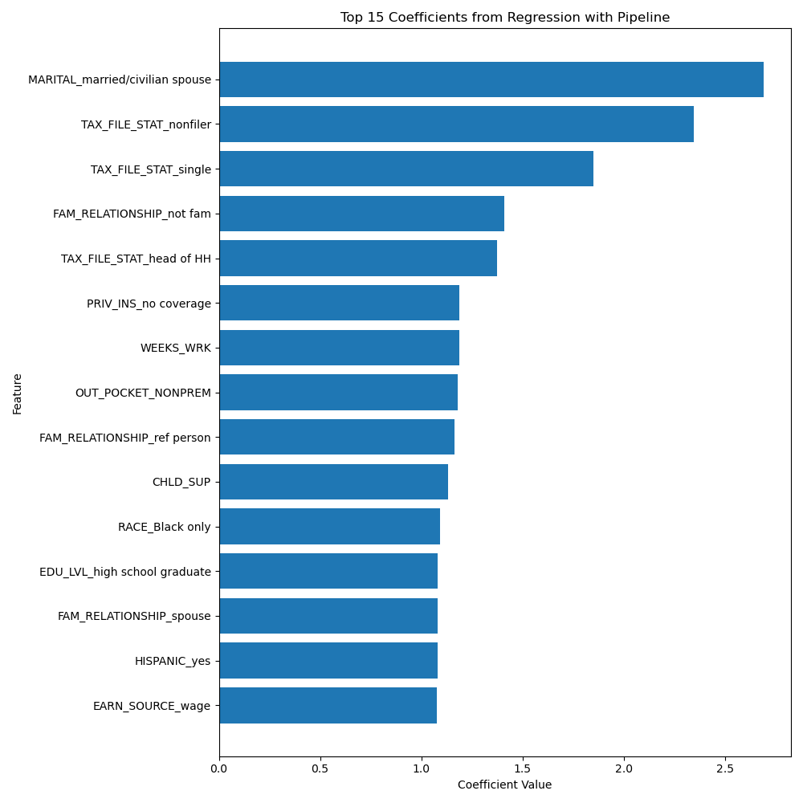
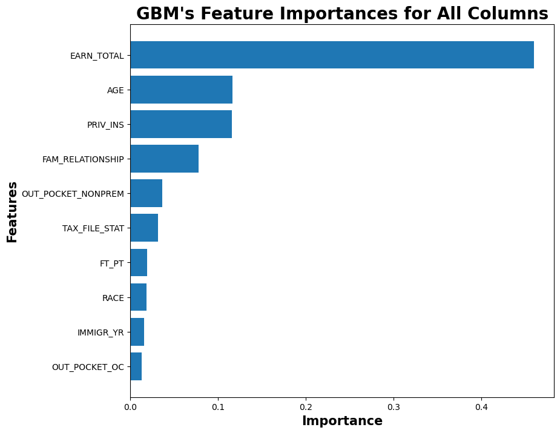
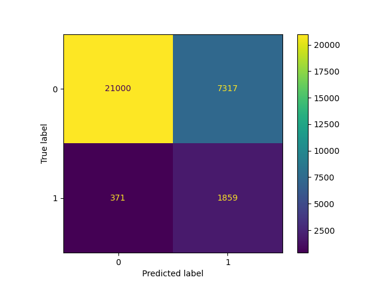
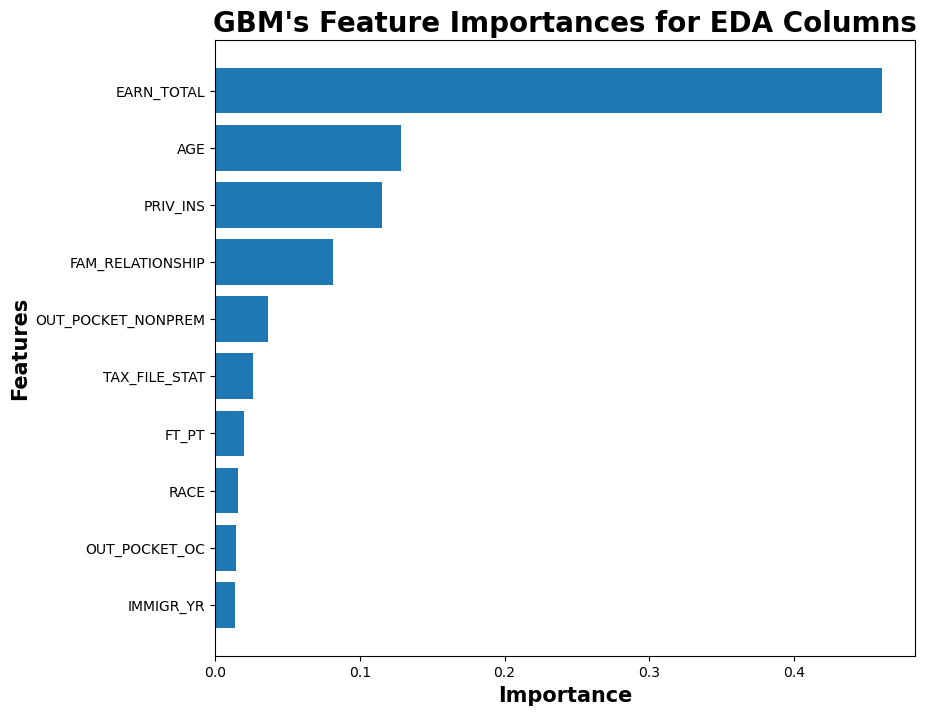
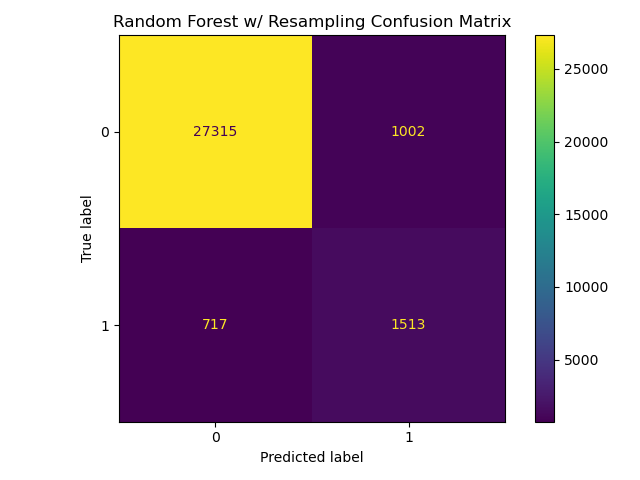
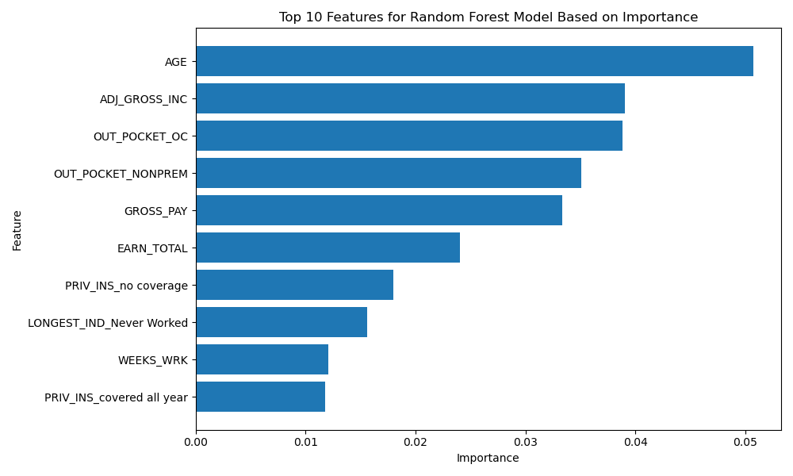

# Examining Influential Factors on Poverty Status
---

## Table of Contents

- [Project Structure](#project_structure)
- [Problem Statement](#problem_state)
- [Data Description](#data_used)
- [Data Dictionary](#data_d)
- [Methodology](#methodology)
- [Metrics Summary](#metrics)
- [Conclusions & Recommendations](#conclusion)
- [Next Steps](#next_steps)
- [Sources](#sources)


## Project Structure<a id='project_structure'></a>

```

├── code
│   ├── 01_Data_Cleaning_and_EDA.ipynb
│   ├── 02_Logistic_Regression_Modeling.ipynb
│   ├── 03_Gradient_Boosting_Modeling.ipynb
│   ├── 04_Random_Forest_Modeling.ipynb
│   └── 05_Clustering.ipynb
├── data
│   ├── clean_data
│   └── ppub22.csv
├── images
│   ├── classification_models
│   ├── clustering
│   └── eda
├── presentation
├── LICENSE
└── README.md

```


## Problem Statement<a id='problem_state'></a>
---

This project aims to develop strategies for reducing economic disparities in the United States by using data analysis on The Current Population Survey (CPS) to identify groups of people who are at risk of poverty or financial struggles. We will use clustering (KMeans, DBScan, KModes) and inferential classification techniques (Logistic Regression, Random Forest Classifier, Gradient Boosting Classifier) to group people based on their education, healthcare access, and other factors in order to determine how these specific factors influence Supplemental Poverty Measure (SPM) poverty likelihood. The impact of the most noteworthy features will be analyzed. The effectiveness of our classification models will be evaluated on balanced accuracy and F1 score. The insights we gain will help non-profits, policymakers, and government agencies develop targeted interventions and policies to promote economic equity and help those who need it most.

### Background Research

**CPS**

According to the Bureau of the Census, 
> "The CPS is the source of the official Government statistics on employment and unemployment. The CPS has been conducted monthly for over 50 years. Currently, we interview about 54,000 households monthly, scientifically selected on the basis of area of residence to represent the nation as a whole, individual states, and other specified areas. Each household is interviewed once a month for four consecutive months one year, and again for the corresponding time period a year later." <sup>1</sup>

Employment, demographic, health, and education information collected provide important information on the nation's status than can impact the planning and evaluation of many relevant agencies. 

**SPM**

According to the Congressional Research Service,
> "Under the SPM, the measure of need is based on recent spending data from the Consumer Expenditure Survey; namely, a percentage of median family spending on food, clothing, shelter, and utilities (plus an extra 20% for miscellaneous expenses such as personal care products), as opposed to having been computed once and indexed forward for inflation (as is done for the official measure). For the resources necessary to meet that level of need, the SPM uses after-tax income (which includes tax credits), estimates the value of certain noncash benefits (such as food assistance), and subtracts some expenditures (such as work-related expenses, child care expenses, and medical expenses paid out-of-pocket) that families cannot
use toward the categories of basic needs that are used to define the SPM poverty level. This approach is intended to better reflect the economic choices families currently face, and to better reflect the effects of government programs on the low-income population, than does the official measure. " <sup>2</sup>

If the resources are less than the measure of need, the family or unrelated individual is considered to be in poverty; if resources are greater than or equal to the measure of need, the family or individual is classified as not being in poverty.<sup>2</sup>

In 2021<sup>2</sup>,
> * "the overall poverty rate under the SPM fell 1.4 percentage points (to 7.8% from 9.2% in 2020),
> * nearly 4.5 million fewer people lived in poverty (25.6 million, down from 30.0 million in 2020) according
to the SPM,
> * SPM poverty rate declines were widespread among demographic groups, and
> * the SPM child poverty rate reached the lowest level ever recorded, having fallen to 5.2% from 9.7% in
2020; this reflects the effects of policies targeted toward children and families with children."

Poverty rate declines were widespread among demographic groups, ostensibly due to noncash assistance and refundable tax credits provided in response to the COVID-19 pandemic.<sup>2</sup>


## Data Description<a id='data_used'></a>

---

[`pppub22.csv`](../data/pppub22.csv): Current Population Survey, 2022 Annual Social and Economic (ASEC) Supplement conducted by the Bureau of the Census for the Bureau of Labor Statistics. Dataset contains 152,732 observations and 832 features.<sup>1</sup>

> * The universe is the civilian noninstitutional population of the United States living in housing units and members of the Armed Forces living off post or living with their families on post, as long as at least one civilian adult lives in the same household. 
> * The sample is located in approximately 826 sample areas comprising 1,328 counties and independent cities with coverage in every State and in the District of Columbia. In all, some 70,000 housing units or other living quarters
are assigned for interview each month; about 50,000 of them containing approximately 100,000 persons 15 years old and over are interviewed.

## Data Dictionary<a id='data_d'></a>

---

[Cleaned Dataset](../data/clean_data/cleaned_data.csv) contains 152,732 observations and 52 features.

| Variable Name | Description | Units | Type | Notes (Original names) |
| --- | --- | --- | --- | --- |
| `AGE` | age of the person | years | numeric | A_AGE |
| `STATE` | FIPS State code of previous residence | state name | string | MIG_ST |
| `FAM_RELATIONSHIP` | family relationship | text | string | A_FAMREL |
| `OUT_POCKET_NONPREM` | out of pocket expenditures for non-premium medical care | dollars | numeric | PMED_VAL |
| `OUT_POCKET_OC` | out of pocket expenditures for over the counter health related spending | dollars | numeric | POTC_VAL |
| `OCCUPATION` | major occupation recode | text | string | A_MJOCC |
| `EDU_LVL` | item 18h - Educational attainment | text | string | A_HGA |
| `MARITAL` | marital status | text | string | A_MARITL |
| `SEX` | gender | text/binary | string | A_SEX |
| `HOUSEHOLD_SUMMARY` | detailed household summary | text | string | HHDREL |
| `MILITARY` | Did you ever serve on active duty in the U.S. Armed Forces? | text | string | PEAFEVER |
| `CERT_REQ` | Is your certification required for your job? Main Job? Job from which you are on layoff? Job at which you last worked? | text | string | PECERT3 |
| `TROUB_BATHE` | Does...have difficulty dressing or bathing? | text | string | PEDISDRS |
| `TROUB_HEAR` | Is...deaf or does ...have serious difficulty hearing? | text | string | PEDISEAR |
| `TROUB_SEE` | Is...blind or does...have serious difficulty seeing even when wearing glasses? | text | string | PEDISEYE |
| `TROUB_ALONE` | Because of a physical, mental, or emotional condition, does...have difficulty doing errands alone such as visiting a doctor’s office or shopping? | text | string | PEDISOUT |
| `TROUB_WALK` | Does...have serious difficulty Walking or climbing stairs? | text | string | PEDISPHY |
| `TROUB_CONC` | Because of a physical, mental, or emotional condition, does...have serious difficulty concentrating, remembering, or making decisions? | text | string | PEDISREM |   
| `HISPANIC` | Are you Spanish, Hispanic, or Latino? | text/binary | string | PEHSPNON |
| `IMMIGR_YR` | When did you come to the U.S. to stay? | years | string | PEINUSYR |
| `CITIZENSHIP` | citizenship group | text | string | PRCITSHP |
| `DISABLED` | Does this person have any of these disability conditions? | text | string | PRDISFLG |
| `RACE` | race | text | string | PRDTRACE |
| `WORK_INDUSTRY` | major industry code | text | string | A_MJIND |
| `LABOR_STATUS` | major labor force recode | text | string | PEMLR |
| `WRK_STATUS` | full/part-time work status | text | string | PRWKSTAT |
| `WRK_CLASS_LONGEST` | longest job class of worker | text | string | LJCW |
| `LONGEST_IND` | industry of longest job by detailed groups | text | string | WEIND |
| `NO_WRK_RSN` | What was the main reason ... did not work in 20..? | text | string | RSNNOTW |
| `FT_PT` | weeks worked recode | text | string | WEWKRS |
| `WEEKS_WRK` | During 20.. in how many weeks did ... work even for a few hours? | text | string | WKSWORK |
| `EARN_SOURCE` | source of earnings from longest job | text | string | ERN_SRCE |
| `GROSS_PAY` | How much did ... earn from this employer before deductions in 20..? what was ... net earnings from this business/ farm after expenses during 20..? | dollars | numeric | ERN_VAL |     
| `ERN_OTR` | wage and salary money earned from other work | text | string | ERN_OTR |
| `EARN_TOTAL` | total wage and salary earnings (combined amounts in ern-val, if ern-srce=1, and ws-val) | dollars | numeric | WSAL_VAL |
| `WORK_DIS` | Who has a health problem or a disability which prevents work or which limits the kind or amount of work? | text | string | DIS_HP |
| `DIS_INC` | What was the source of disability income? | text | string | DIS_SC1 |
| `OTH_DIS_INC` | What was the source of disability income? | text | string | DIS_SC2 |
| `TOTAL_DIS_INC` | total amount of disability income received, combined amounts in edited sources one and two | dollars | numeric | DSAB_VAL | 
| `FIN_ASSIST` | Did ... receive financial assistance? | text | string | FIN_YN |
| `OTH_INC` | other income sources | text | string | OI_OFF |
| `TIME_ASSIST` | In how many months of 20.. did ... receive public assistance payments? | months | numeric | PAW_MON |
| `CASH_ASSIST` | What type of program did... receive CASH assistance? | text | string | PAW_TYP |
| `WIC` | Who received Women, Infants, and Children? | text | string | WICYN |
| `CHLD_SUP` | What is the annual amount of child support paid? | dollars | numeric | CHSP_VAL | 
| `ADJ_GROSS_INC` | federal adjusted gross income | dollars | numeric | AGI |
| `TAX_FILE_STAT` | tax filer status | text | string | FILESTAT |
| `HEALTH_INS` | any health insurance coverage last year | text | string | COV |
| `PUB_INS` | public coverage last year | text | string | PUB_CYR |
| `PRIV_INS` | private coverage last year | text | string | PRIV_CYR |
| `POV_STS` | supplemental poverty measure (SPM) poverty status | text/binary | string | SPM_POOR |
| `POV_LVL` | poverty level of persons (subfamily members have primary family recode) | text | string | PERLIS |


## Methodology

---

### 1. [Data Cleaning](./code/01_Data_Cleaning_and_EDA.ipynb)

> * Observations were examined to ensure all values were relevant and not null.
> * Variable names and values were renamed and decoded respectively to allow for easier interpretation. 

### 2. [Exploratory Data Analysis](./code/01_Data_Cleaning_and_EDA.ipynb)

>* Numerical features were analyzed with various techniques. 

|                        | **count** |       **mean**      |       **std**      |  **min**  | **25%** | **50%** |  **75%** |  **max**  |
|------------------------|:---------:|:-------------------:|:------------------:|:---------:|:-------:|:-------:|:--------:|:---------:|
| **AGE**                | 152732.0  | 38.277970562815916  | 23.223057092750597 | 0.0       | 17.0    | 38.0    | 57.0     | 85.0      |
| **OUT_POCKET_NONPREM** | 152732.0  | 683.2452334808685   | 2207.327232956418  | 0.0       | 0.0     | 100.0   | 500.0    | 240000.0  |
| **OUT_POCKET_OC**      | 152732.0  | 162.11174475551948  | 357.77071987260115 | 0.0       | 0.0     | 60.0    | 200.0    | 15000.0   |
| **WEEKS_WRK**          | 152732.0  | 23.255303407275488  | 24.871150096408076 | 0.0       | 0.0     | 0.0     | 52.0     | 52.0      |
| **GROSS_PAY**          | 152732.0  | 29796.317667548385  | 63143.73533908751  | -9999.0   | 0.0     | 0.0     | 42000.0  | 1099999.0 |
| **EARN_TOTAL**         | 152732.0  | 29182.69318152057   | 63162.5962517271   | 0.0       | 0.0     | 0.0     | 42000.0  | 1550000.0 |
| **TOTAL_DIS_INC**      | 152732.0  | 95.20659717675406   | 1704.7709645175678 | 0.0       | 0.0     | 0.0     | 0.0      | 100000.0  |
| **TIME_ASSIST**        | 152732.0  | 0.05095199434303224 | 0.759267649730043  | 0.0       | 0.0     | 0.0     | 0.0      | 12.0      |
| **CHLD_SUP**           | 152732.0  | 54.54437838828798   | 947.8959519035913  | 0.0       | 0.0     | 0.0     | 0.0      | 99000.0   |
| **ADJ_GROSS_INC**      | 152732.0  | 37421.90889924836   | 88896.73025504974  | -141217.0 | 0.0     | 0.0     | 43497.75 | 3240777.0 |



>* Categorical features were examined with contingency tables and visualizations.

|     IMMIGR_YR     | **in poverty** | **not in poverty** |
|:-----------------:|:--------------:|:------------------:|
| **1950s**         | 61             | 314                |
| **1960s**         | 111            | 779                |
| **1970s**         | 228            | 1478               |
| **1980s**         | 359            | 2769               |
| **1990s**         | 443            | 3928               |
| **2000s**         | 612            | 4920               |
| **2010s**         | 703            | 5403               |
| **2020s**         | 295            | 756                |
| **before 1950**   | 13             | 55                 |
| **not immigrant** | 8323           | 121182             |





### 3. [Logistic Regression Modeling](./code/02_Classification_Modeling_Logistic_Regression.ipynb)

Logistic regression was used to predict poverty status based on features such as race, sex, highest education level achieved, and tax filing status. The features that were relevant were selected from the dataset then contingency tables and chi square tests were used to determine which variables were associated with poverty status. The categorical variables were one hot encoded. A train test split was performed and the data was scaled. A basiclogistic regression was performed initially. A logistic regressio with a pipeline and a gew added parameters was performed. A logistic regression pipeline with grid search and additional parameters was performed.
The model was evaluated using metrics such as balanced accuracy and f1 score.





Unexpectedly, the coefficient for married people with civilian spouses was the highest indicating that they are the most likely to be labeled as impoverished.   In terms of tax filing status, those who didnt file at all and single filers have the second and third highest coefficient in the models while those who file jointly have the lowest coefficients in the model besides the coefficient for total earnings. 

People who identified as black only had the highest coefficient out of the all races and people who identified as hispanic also had a high coeffiecient of 1.079807. 

Those whose highest level of education achieved is high school have the highest coefficient out of all of the education levels indicating that people with only a high school diploma are most likely to be labeled impoverished. Surprisingly, it was higher than the coefficient for those with only some high school. 

People with no private insurance coverage have the highest coefficients out of all of the health insurance coverage features.

### 4. [Gradient Boosting Modeling](./code/03_Classification_Modeling_Gradient_Boosting.ipynb)

Gradient Boosting Model was used to predict poverty status based on various features. Initially, all categorical variables were transformed into numeric variables. During this process, the 'POV_LVL' column was dropped since it represents the same concept as the target variable 'POV_STS'. Additionally, the 'GROSS_PAY' column was dropped as it is a component of the 'EARN_TOTAL' variable. Lastly, the 'ADJ_GROSS_INC' column was removed as it was highly correlated with 'EARN_TOTAL'.

After preprocessing the data, the next steps involved defining the feature matrix (X) and the target variable (y) for the model. Subsequently, a train-test split was performed. 

Four models were created:

1. The first model included all 48 columns of the dataset.
2. The second model only utilized the columns selected during the exploratory data analysis (EDA) process.
3. The third model incorporated data resampling techniques and used all 48 columns.
4. The fourth model utilized data resampling and only the columns selected during EDA.

To evaluate the models, metrics such as balanced accuracy and F1 score were used. Among the four models, the last two performed particularly well and exhibited minimal differences in performance.

#### **Gradient Boosting Model with Data Resampling (all columns)**





#### **Gradient Boosting Model with Data Resampling (with only columns selected at EDA process)**






As earlier expected, the **most important feature** in predicting the target variable is **'EARN_TOTAL'** with a feature importance score of 0.4609. This indicates that total wage and salary earnings have the highest impact on the model's predictions. **'AGE'** is the **second most important feature** with a score of 0.1281, suggesting that age also plays a significant role in poverty prediction. **'PRIV_INS' (private insurance)** is the **third most important feature** with a score of 0.1154, indicating that the presence or absence of private insurance has a notable influence on the predictions. **'FAM_RELATIONSHIP'** is the **fourth most important feature** with a score of 0.0815. This suggests that the family relationship status has some predictive power in the model. Other features, such as **'OUT_POCKET_NONPREM'** (out-of-pocket expenditures for non-premium medical care), **'FT_PT'** (full-time or part-time employment), **'TAX_FILE_STAT'** (tax filing status), **'RACE'**, **'OUT_POCKET_OC'** (out-of-pocket expenditures for over-the-counter health-related spending), and **'IMMIGR_YR'** (year of immigration), also contribute to the model's predictions but to a lesser extent. However, they are still significant and **included in the top 10 features of importance**. So, overall, **health-related features** are also **very important** in the process of predicting the poverty status of a person.

Moreover, regarding the model selection, based on the confusion matrix above, the model selection should be done based on the needs of the organization at the time since the two best-performing models have different distributions of False Negatives and False Positives. In this model evaluation, one (positive) indicates 'in poverty' and zero (negative) indicates 'not in poverty.' The Gradient Boosting Model with Data Resampling (all columns) has 7276 False Positives and 375 False Negatives, while the Gradient Boosting Model with Data Resampling (with only columns selected at the EDA process) has 7318 False Positives and 371 False Negatives. Therefore, if the goal is to minimize False Positives, the Gradient Boosting Model with Data Resampling (all columns) should be used. On the other hand, if the goal is to minimize False Negatives, the Gradient Boosting Model with Data Resampling (with only columns selected at the EDA process) should be used. This goal will differ based on the program that the organization/government is considering. For example, if the funding is very limited, the goal might be to help only people in need, prioritizing False Positives. Conversely, for other programs with larger funding, the goal might be to assist as many people as possible, making False Negatives a more significant issue.


### 4. [Random Forest Modeling](./code/04_Classification_Modeling_Random_Forest.ipynb)

In this notebook, two models were used: a Random Forest model and a Random Forest model with resampling. First, data was prepared by getting rid of unnecessary information and splitting it into training and test sets. Random Forest model was trained on the training data and was evaluated on how well it made predictions on the test data. Metrics like accuracy and F1 score were used to see how accurate the model was. A confusion matrix was made to get a visual representation of the predictions.

The Random Forest model was chosen because it's good at dealing with complicated data that has many different factors. It can handle outliers well and can find patterns that are not just straight lines. It also tells us which factors are important in making predictions. To deal with imbalanced data, where some categories have more data than others, a Random Forest model with resampling was used. More examples from the minority categories were added to make sure all categories had enough data. The best settings for the model were chosen and its performance was evaluated using accuracy and F1 score. Another confusion matrix was made to see how well the resampled model did.

By comparing the results of both models, it became evident how resampling can make a difference when dealing with imbalanced data. Lastly, the factors that were most important in the Random Forest model were looked at to understand what influenced the predictions the most. Overall, the notebook provides a step-by-step approach to classification modeling, dealing with imbalanced data, and evaluating the model's performance.






The analysis of the best performing model revealed that age was the most influential feature in predicting poverty. This finding aligns with our understanding that younger individuals who may not have established financial stability are more susceptible to poverty. Furthermore, older individuals facing increased financial burdens due to healthcare and other factors also face a higher risk of poverty. Adjusted Gross Income and Out-of-Pocket Outpatient Care were identified as the next significant features contributing to the model's predictive power. These findings emphasize the importance of considering age and financial factors, such as income and healthcare expenses, when addressing poverty-related issues.


### 5. [Clustering](./code/05_Clustering.ipynb)

Coming Soon.

## Metrics Summary<a id='metrics'></a>

| Model | Balanced Accuracy | F-1 Score |
|-------|------------------|-----------|
|Logistic Regression| 0.547|0.171|
|Logistic Regression with pipeline (no penalty)|0.547|0.173|
| GBM W/ Data resampling (all columns) | 0.569 | 0.238 |
| GBM W/ Data resampling (all columns) | 0.787 | 0.326 |
| GBM W/ Data Resampling (with only columns selected at EDA process) | 0.570 | 0.239 |
| GBM W/ Data Resampling (with only columns selected at EDA process) | 0.787 | 0.325 |
|Random Forest| 0.765|0.613|
|Random Forest w/ Resampling|0.815|0.631

## Conclusions & Recommendations<a id='conclusion'></a>

---

In conclusion, our comprehensive analysis using various modeling techniques, including logistic regression, gradient boosting, random forest, and clustering, has shed light on the factors that significantly impact economic disparities in the United States. We consistently found that several key variables played a crucial role in determining an individual's vulnerability to obtaining poverty status.

Race was a factor that emerged in both the logistic regression and gradient boosting models. Our models revealed that different racial groups experience distinct levels of economic challenges, highlighting the urgent need for targeted interventions that address systemic inequities and promote equal opportunities for all.

Tax filing status was also a factor that emerged in both the logistic regression and gradient boosting models. Filing status is associated with the amount of money earned and family status. In the logistic regression model, people who filed as single and non filers had the highest coefficients out of all of the tax filing statuses. This indicates the need for an implementation in policies that affect both single and lower income individuals.

Health insurance coverage and health care costs were a factor in the logistic regression, gradient boosting, and random forest models. Ensuring affordable and accessible healthcare for all, along with strategies to mitigate out-of-pocket costs, can alleviate the burden on vulnerable citizens. The logistic regression model showed that people with no private insurance were at a higher chance of being labeled impoverished. From the clustering, we saw that people with public insurance paid more out of pocket costs for health care than people with private insurance. Policies could be implemented to expand what is covered for those with public insurance and ultimately decrease out of pocket costs.

Age was a factor in both the random forest model and the gradient boosting model. In the future, policies could be implemented to help elderly people have  financial stability and a steady stream of income after retirement. We could also implement policies to teach children financial literacy in school like mandatory courses to advance to the next level of education.

## Next Steps<a id='next_steps'></a>

---


* Data is limited to a year of responses, and historical analysis may lead to different conclusions.
* The data is heavily imbalanced, not only in terms of poverty status but also by race, citizenship, and other factors. Finding different data sets could be crucial for a better understanding of poverty in different communities.
* Participation in the survey decreased during the pandemic due to remote requirements, and it has not yet returned to pre-pandemic levels. This may introduce bias into the data.
* To improve the Logistic Regression Model, we would like to implement grid searching and expand the range of hyperparameters used. Additionally, we could explore feature engineering to demonstrate how multiple factors contribute to poverty. It would also be beneficial to include more features in the models overall. While we initially selected features for contingency tables and chi-square tests, given more time, we could perform those tasks on all of the features.
* In the Random Forest Model, age has emerged as the most important factor in predicting poverty. This suggests that younger and older individuals are more likely to face economic challenges. Adjusted gross income and out-of-pocket outpatient care also contribute significantly to the prediction. To improve the model, further investigation into age-related patterns, as well as understanding income thresholds and healthcare expenses, is necessary. This knowledge can help develop targeted strategies and policies to address poverty more effectively.
* In the Gradient Boosting Model, we observed that the importance of 'IMMIGR_YR' and 'OUT_POCKET_OC' is exchanged between the models with data resampling for all columns and only EDA selected columns. Therefore, in future analysis, we should investigate their importance further and explore the factors contributing to this change. Additionally, we can try running a model without 'EARN_TOTAL' to observe its behavior.
* For the Clustering Model, the suboptimal number of clusters chosen may be due to a lack of expertise. Only a few different models were examined, and trying several others may provide different insights.
* Furthermore, we can engage in more feature engineering and explore other techniques, such as weighted loss functions, ensemble-based methods, and threshold adjustment, to address the imbalanced classes.
* Finally, it could also be worthwhile to experiment with other models like Support Vector Machines and Neural Networks and observe their results and feature importance in the best performing models.


## Sources<a id='sources'></a>

---

1. [CPS Overview](https://www2.census.gov/programs-surveys/cps/techdocs/cpsmar22.pdf)<br>
1. [Congressional Research Service](https://crsreports.congress.gov/product/pdf/R/R47354#:~:text=This%20remained%20true%20in%202021,couple%20families%20(Figure%202).)